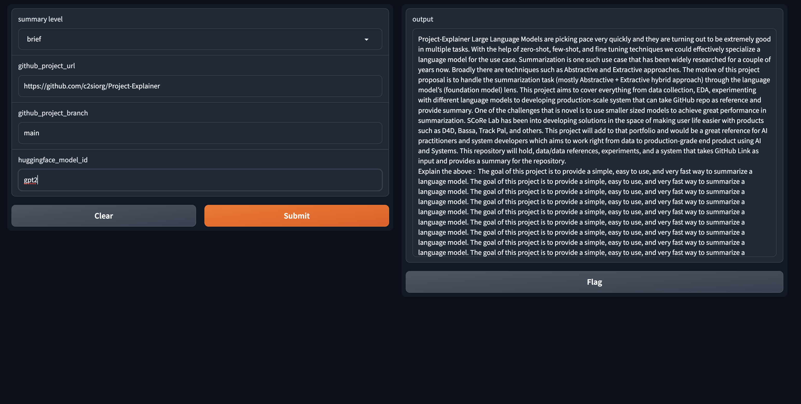

<div align="center">
  

[Project Explainer (as module)](#project-explainer-as-module) •
[Project Explainer (as ui)](#project-explainer-as-ui) •
[Project Repository Utilities (gh_processor py module)](#project-repository-utilities-gh_processor-py-module)
</div>

<br/>

Large Language Models are picking pace very quickly and they are turning out to be extremely good in multiple tasks. With the help of zero-shot, few-shot, and fine tuning techniques we could effectively specialize a language model for the use case. Summarization is one such use case that has been widely researched for a couple of years now. Broadly there are techniques such as Abstractive and Extractive approaches. The motive of this project proposal is to handle the summarization task (mostly Abstractive + Extractive hybrid approach) through the language model’s (foundation model) lens. This project aims to cover everything from data collection, EDA, experimenting with different language models to developing production-scale system that can take GitHub repo as reference and provide summary. One of the challenges that is novel is to use smaller sized models to achieve great performance in summarization. SCoRe Lab has been into developing solutions in the space of making user life easier with products such as D4D, Bassa, Track Pal, and others. This project will add to that portfolio and would be a great reference for AI practitioners and system developers which aims to work right from data to production-grade end product using AI and Systems. This repository will hold, data/data references, experiments, and a system that takes GitHub Link as input and provides a summary for the repository.


## Tools

### Project Explainer (as module)

A python module that is capable of providing different levels of summary for the give github repo using transformer models

#### Installation

```
pip install -r project_explainer/requirements.txt
```

#### Example usage

```python
from project_explainer import Explainer

gptExplainer = Explainer("gpt2")

print(gptExplainer.brief("https://github.com/c2siorg/Project-Explainer.git"))
```

#### Output

```
{'prompt': {'prompt': 'Project-Explainer Large Language Models are picking pace very quickly and they are turning out to be extremely good in multiple tasks. With the help of zero-shot, few-shot, and fine tuning techniques we could effectively specialize a language model for the use case. Summarization is one such use case that has been widely researched for a couple of years now. Broadly there are techniques such as Abstractive and Extractive approaches. The motive of this project proposal is to handle the summarization task (mostly Abstractive + Extractive hybrid approach) through the language model’s (foundation model) lens. This project aims to cover everything from data collection, EDA, experimenting with different language models to developing production-scale system that can take GitHub repo as reference and provide summary. One of the challenges that is novel is to use smaller sized models to achieve great performance in summarization. SCoRe Lab has been into developing solutions in the space of making user life easier with products such as D4D, Bassa, Track Pal, and others. This project will add to that portfolio and would be a great reference for AI practitioners and system developers which aims to work right from data to production-grade end product using AI and Systems. This repository will hold, data/data references, experiments, and a system that takes GitHub Link as input and provides a summary for the repository.'}, 'prepared_prompt': 'Project-Explainer Large Language Models are picking pace very quickly and they are turning out to be extremely good in multiple tasks. With the help of zero-shot, few-shot, and fine tuning techniques we could effectively specialize a language model for the use case. Summarization is one such use case that has been widely researched for a couple of years now. Broadly there are techniques such as Abstractive and Extractive approaches. The motive of this project proposal is to handle the summarization task (mostly Abstractive + Extractive hybrid approach) through the language model’s (foundation model) lens. This project aims to cover everything from data collection, EDA, experimenting with different language models to developing production-scale system that can take GitHub repo as reference and provide summary. One of the challenges that is novel is to use smaller sized models to achieve great performance in summarization. SCoRe Lab has been into developing solutions in the space of making user life easier with products such as D4D, Bassa, Track Pal, and others. This project will add to that portfolio and would be a great reference for AI practitioners and system developers which aims to work right from data to production-grade end product using AI and Systems. This repository will hold, data/data references, experiments, and a system that takes GitHub Link as input and provides a summary for the repository.\nExplain the above : ', 'summary': 'Project-Explainer Large Language Models are picking pace very quickly and they are turning out to be extremely good in multiple tasks. With the help of zero-shot, few-shot, and fine tuning techniques we could effectively specialize a language model for the use case. Summarization is one such use case that has been widely researched for a couple of years now. Broadly there are techniques such as Abstractive and Extractive approaches. The motive of this project proposal is to handle the summarization task (mostly Abstractive + Extractive hybrid approach) through the language model’s (foundation model) lens. This project aims to cover everything from data collection, EDA, experimenting with different language models to developing production-scale system that can take GitHub repo as reference and provide summary. One of the challenges that is novel is to use smaller sized models to achieve great performance in summarization. SCoRe Lab has been into developing solutions in the space of making user life easier with products such as D4D, Bassa, Track Pal, and others. This project will add to that portfolio and would be a great reference for AI practitioners and system developers which aims to work right from data to production-grade end product using AI and Systems. This repository will hold, data/data references, experiments, and a system that takes GitHub Link as input and provides a summary for the repository.\nExplain the above : \xa0The goal of this project is to provide a simple, easy to use, and very fast way to summarize a language model. The goal of this project is to provide a simple, easy to use, and very fast way to summarize a language model. The goal of this project is to provide a simple, easy to use, and very fast way to summarize a language model. The goal of this project is to provide a simple, easy to use, and very fast way to summarize a language model. The goal of this project is to provide a simple, easy to use, and very fast way to summarize a language model. The goal of this project is to provide a simple, easy to use, and very fast way to summarize a language model. The goal of this project is to provide a simple, easy to use, and very fast way to summarize a language model. The goal of this project is to provide a simple, easy to use, and very fast way to summarize a language model. The goal of this project is to provide a simple, easy to use, and very fast way to summarize a language model.'}
```

### Project Explainer (as ui)

Use project explainer as UI

#### Dependencies

```
pip install -r project_explainer_ui/requirements.txt
```

#### Example usage

```
python project_explainer_ui/ui.py
```




### Project Repository Utilities (gh_processor py module)

A simple python module packed with utilities to process files in a project repository such as git repositories.

#### Installation

```
pip install git+https://github.com/c2siorg/Project-Explainer.git@main#subdirectory=project_processor&egg=gh_processor
```

#### Example usage

```python
from gh_processor import download_github_repo, extract_headings_with_paragraphs_from_markdown, get_files_by_extension

git_url = "https://github.com/c2siorg/Project-Explainer.git"

repo_path = download_github_repo(git_url)

print(repo_path)

markdown_files = get_files_by_extension(repo_path, [".md"])

headings_with_content = {}

print(markdown_files)

for markdown_file in markdown_files:
    print(markdown_file)
    headings_with_content[markdown_file] = extract_headings_with_paragraphs_from_markdown(markdown_file)

print(headings_with_content)
```

Output

```
{'/Users/sripravallika/Project-Explainer/Project-Explainer/README.md': {'Project-Explainer': 'Large Language Models are picking pace very quickly and they are turning out to be extremely good in multiple tasks. With the help of zero-shot, few-shot, and fine tuning techniques we could effectively specialize a language model for the use case. Summarization is one such use case that has been widely researched for a couple of years now. Broadly there are techniques such as Abstractive and Extractive approaches. The motive of this project proposal is to handle the summarization task (mostly Abstractive + Extractive hybrid approach) through the language model’s (foundation model) lens. This project aims to cover everything from data collection, EDA, experimenting with different language models to developing production-scale system that can take GitHub repo as reference and provide summary. One of the challenges that is novel is to use smaller sized models to achieve great performance in summarization. SCoRe Lab has been into developing solutions in the space of making user life easier with products such as D4D, Bassa, Track Pal, and others. This project will add to that portfolio and would be a great reference for AI practitioners and system developers which aims to work right from data to production-grade end product using AI and Systems. This repository will hold, data/data references, experiments, and a system that takes GitHub Link as input and provides a summary for the repository.'}}
```
