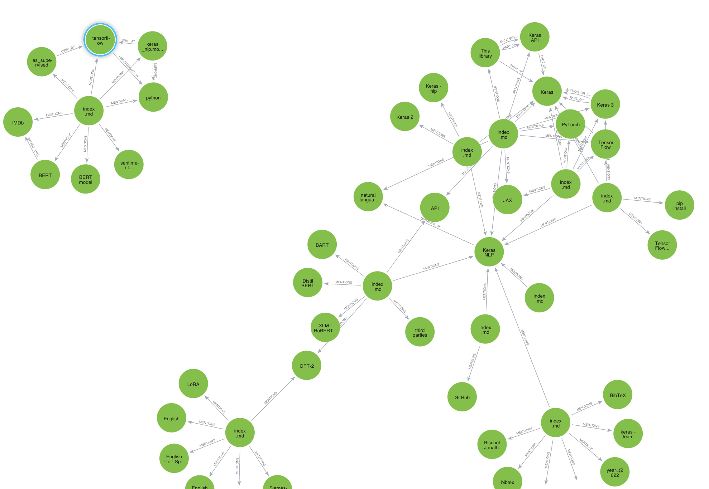

# Knowledge Graph with Relik and Llama-Index

This markdown file demonstrates an experiment in building a knowledge graph using the `Relik` and `Llama-Index` Property Graphs. The steps include coreference resolution with `Spacy`, relation extraction with `Relik`, and knowledge graph construction with `llama-index PropertyGraphs`,stored in `neo4j`.

## Import Necessary Libraries

Import the essential libraries required for the experiment. These include NLP tools (`Spacy`, `coreferee`), document readers, large language models (LLMs), embeddings, and Neo4j for graph storage.

```python
import spacy, coreferee
from llama_index.core import SimpleDirectoryReader
import nest_asyncio
from llama_index.llms.ollama import Ollama
from llama_index.embeddings.huggingface import HuggingFaceEmbedding
from llama_index.core import PropertyGraphIndex
from llama_index.core import Settings
from llama_index.extractors.relik.base import RelikPathExtractor
from llama_index.graph_stores.neo4j import Neo4jPGStore
```

## Coreference Resolution Function

Sets up a function to resolve coreferences in a text. This is crucial for ensuring that the references to entities like "she" or "it" are correctly linked back to their antecedents,removing de-duplication of nodes from knowledge graph.

```python
coref_nlp = spacy.load('en_core_web_lg')
coref_nlp.add_pipe('coreferee')

def coref_text(text):
    coref_doc = coref_nlp(text)
    resolved_text = ""

    for token in coref_doc:
        repres = coref_doc._.coref_chains.resolve(token)
        if repres:
            resolved_text += " " + " and ".join(
                [
                    t.text
                    if t.ent_type_ == ""
                    else [e.text for e in coref_doc.ents if t in e][0]
                    for t in repres
                ]
            )
        else:
            resolved_text += " " + token.text

    return resolved_text
```

### Example Usage of Coreference Resolution

An example is provided to demonstrate how the `coref_text` function resolves references in the text. 

```python
coref_text("alice is great. she can study for long hours and remember")
# Output: alice is great. alice can study for long hours and remember
```

## Load and Process Documents

The documents are loaded from a specified directory and processed with the coreference resolution function to prepare them for knowledge graph construction.

```python
documents = SimpleDirectoryReader(input_dir='/content/data').load_data()
len(documents)

for doc in documents:
    doc.text = coref_text(doc.text)
```

## Initialize Relik Path Extractor

Here, the `RelikPathExtractor` is initialized, which will be used to extract relationships between entities from the processed documents.

```python
relik = RelikPathExtractor(
    model="relik-ie/relik-relation-extraction-small", model_config={"skip_metadata": True}
)
```

## Set Up Language Model and Embeddings

This section configures the LLM (`Ollama`) and the embedding model (`HuggingFaceEmbedding`) to be used for generating embeddings for the knowledge graph.

```python
llm = Ollama(base_url="http://localhost:11434", model="llama3.1")
embed_model = HuggingFaceEmbedding(model_name="microsoft/codebert-base")
Settings.llm = llm
```

## Configure Neo4j Graph Store

Sets up the connection to a Neo4j database, where the knowledge graph will be stored. Ensure to replace the placeholder for the password with your actual Neo4j password.

```python
username = "neo4j"
password = "*****************************"
url = "neo4j+s://45256b03.databases.neo4j.io"

graph_store = Neo4jPGStore(
    username=username,
    password=password,
    url=url,
    refresh_schema=False
)
```

## Build the Knowledge Graph

Here, the knowledge graph is constructed from the processed documents using the configured tools: `Relik`, `Ollama`, `HuggingFaceEmbedding`, and `Neo4j`.

```python
index = PropertyGraphIndex.from_documents(
    documents,
    kg_extractors=[relik],
    llm=llm,
    embed_model=embed_model,
    property_graph_store=graph_store,
    show_progress=True,
)
```



## Query the Knowledge Graph

Finally, a query engine is created, allowing you to query the knowledge graph. Example queries and their expected outputs are provided.

```python
query_engine = index.as_query_engine(include_text=True)

response = query_engine.query("what is keras nlp?")
print(str(response))

# Output: Keras NLP provides a simple way to fine-tune pre-trained language models for various natural language processing tasks...
```

```python
response = query_engine.query("format for citing keras nlp")
print(str(response))

# Output: To cite Keras NLP, you can refer to the following format: KerasNLP. (n.d.). Retrieved from <https://keras-nlp.github.io/>...
```
